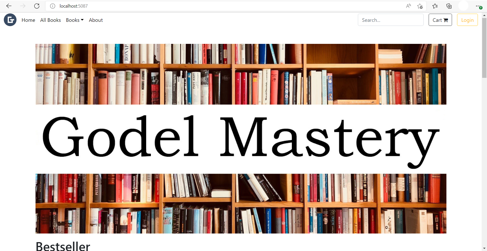
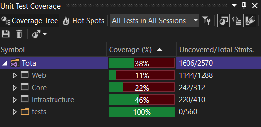

# Book Shop

A sample Book Shop Website built with ASP.NET Core

## APP/Code Features 
- Only Admin can perform Create/Edit/Delete books & view orders.
- Ordinary User can only view books and buy them.
- Managing Shopping Cart using session.
- Authentication & Authorization.
- Responsive UI 
- 3-tier application architecture.

## Framework / Library 
- ASP.NET Core 6.0 *(Backend)*
- Microsoft Sql Server *(DB)*
- Entity Framework Core *(ORM)*
- AutoMapper *(For mapping into Domain Model & DTO)*
- Serilog *(For logging)*
- Bootstrap *(For UI)*

## Visual Studio 2022 and SQL Server

### Admin users credentails
    Username: Admin
    Password: 32145

### Prerequisites

- SQL Server
- Visual Studio 2022

### Steps to run

- Update the connection string in appsettings.json in Lab06.MVC.Web
- Build the whole solution.
- In Solution Explorer, make sure that Lab06.MVC.Web is selected as the Startup Project
- Open the Package Manager Console Window and make sure that Lab06.MVC.Web is selected as the Default project. Then type "Update-Database" then press "Enter". This action will create the database schema.
- In Visual Studio, press "Control + F5".

### How to run the utility for measuring code coverage with tests(For dotCover)

- In Visual Studio, press Extensions -> ReSharper -> Unit Tests -> Cover All Tests From Solution

Percentage of test coverage:

